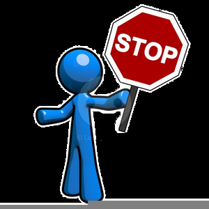

 

<h3> System to decrease anti-social behaviours of fingernail biting and nosepicking whilst using a computer 
 

 

 
  &nbsp;&nbsp;&nbsp;&nbsp;  &nbsp;&nbsp;&nbsp;&nbsp;  &nbsp;&nbsp;&nbsp;&nbsp; 
 
   &nbsp;&nbsp;&nbsp;&nbsp;  
 &nbsp;&nbsp;&nbsp;&nbsp; 

 
 

 
 

 
<h2> Table of Contents

- [Background](#Background)
- [What does it do?](#what-does-it-do)
- [How does it do it?](#how-does-it-do-it)
- [OK, but why?](#ok-but-why)
- [Let's have a look-see, shall we?](#lets-have-a-look-see-shall-we)
   - [Main menu](#main-menu-)
   - [Statistics menu](#statistics-menu-)
   - [Initiating ATV rental](#initiating-atv-rental)
   - [Receiving an item back from loan](#receiving-an-item-back-from-loan)
- [Dependencies](#dependencies)
- [How to install dependencies for Windows](#how-to-install-dependencies-for-windows)
   - [MinGW & gcc compiler](#mingw--gcc-compiler)
   - [MinGW threads](#mingw-threads)
   - [Sqlite3](#sqlite3)
   - [Notes](#notes)
- [Compiling](#compiling)
- [Possible additions](#future-work)

## Background
This project’s viability is assessed by the general personal observation of the increase in ubiquitous computing and the reliance on computers especially in the lives of the young at present. It is further personally observed that the young increasingly manifest anti-social behaviours of nail biting and nose picking when utilising a computer. Hence, there is a need for additional tools to help people to reduce or remove these anti-social behaviours which this project aims to provide. 
  

## What does it do?
The system is designed to detect fingernail biting and nose picking behaviour from user's webcam feed and to "penalise" the user by playing a continuous and horrible sound until the user stops exhibiting these behaviours with a view of drawing attention to and correcting these behaviours. 
 
In the most basic terms, a user navigates to the application's website, sets a webcam facing themselves and presses 'start monitoring'. Subsequently, the system begins to analyse user's webcam feed using a Machine Learning (ML) model to detect four distinct states:

1) Normal State (ie. != Nose Picking (NP) or fingernail biting (FB) or Turned or Covered)
2) NP & FB (prohibited behaviour occurs)
3) Turned State (where webcam is turned away from the user)
4) Covered State (where webcam is covered)

When States 2 (NP & FB), 3 (Turned), 4 (Covered) are recognised by the system, an extremely annoying and loud sound is played until the system decides that the user is exhibiting State 1 (Normal) behaviour. 

## How does it do it?
The most important part of the system is the ML model. I used Google's Teachable Machine to produce one by taking ~600 pictures of myself in each four system States. I varied the positioning of my head in relation to the camera and produced nose picking and fingernail biting events to include fingers from both hands in various positions around my mouth and nose. That was fun :) In addition, photographs of Covered and Turned State were taken with variance of the material covering the lense and surroundings, respectively.
  
 
  

## OK, but why?

## Let's have a look-see, shall we?

### Main menu    

### Statistics menu    

### Initiating ATV rental 

### Receiving an item back from loan 
  

## How to use the system

## Possible additions

